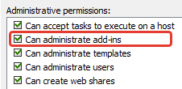
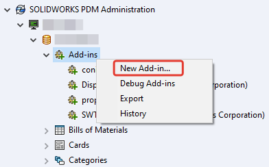
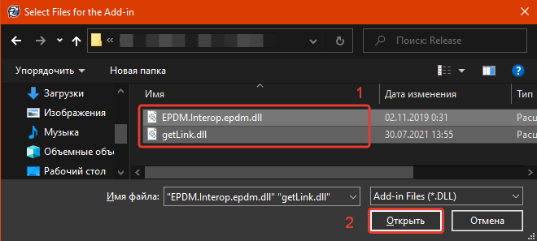
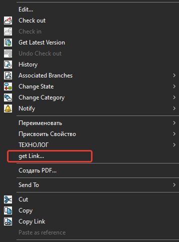
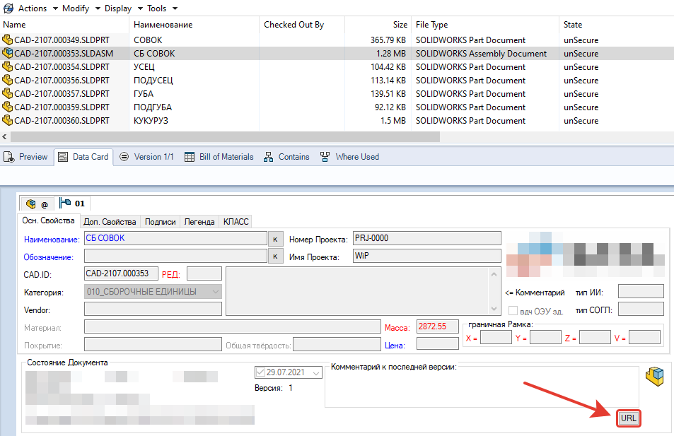
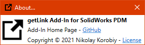
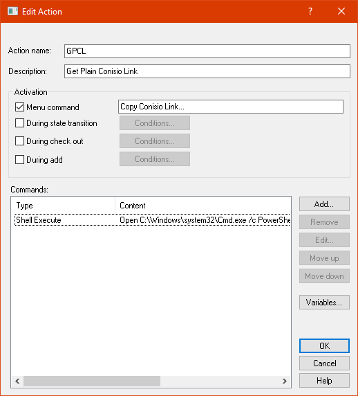
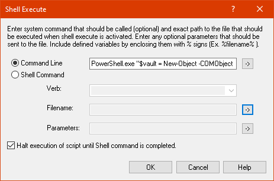

# getLink Add-in for SolidWorks PDM

[](https://semver.org)
[![licence badge]][licence]
[![stars badge]][stars]
[![forks badge]][forks]
[![issues badge]][issues]
[![bug report badge]][bug report]
[![feature request badge]][feature request]

[licence badge]:https://img.shields.io/badge/license-MIT-blue.svg
[stars badge]:https://img.shields.io/github/stars/korbnic/getLink.svg
[forks badge]:https://img.shields.io/github/forks/korbnic/getLink.svg
[issues badge]:https://img.shields.io/github/issues/korbnic/getLink.svg
[bug report badge]:https://img.shields.io/github/issues/korbnic/getLink/Bug%20Report.svg
[feature request badge]:https://img.shields.io/github/issues/korbnic/getLink/Feature%20Request.svg

[licence]:https://github.com/korbnic/getLink/blob/main/LICENSE
[stars]:https://github.com/korbnic/getLink/stargazers
[forks]:https://github.com/korbnic/getLink/network
[issues]:https://github.com/korbnic/getLink/issues
[bug report]:https://github.com/korbnic/getLink/issues?q=is%3Aopen+is%3Aissue+label%3A%22Bug+Report%22
[feature request]:https://github.com/korbnic/getLink/issues?q=is%3Aopen+is%3Aissue+label%3A%22Feature+Request%22

<a href="https://www.buymeacoffee.com/korbnic"></a>

The getLink Add-in extends the functionality of SolidWorks PDM by making available various hyperlinks to files or just path in plain text format. The hyperlinks created(or path) are copied to the Windows clipboard, from which they can be pasted where needed.

  * [Installation](#installation)
  * [Accessing the Tool](#accessing-the-tool)
  * [Use the Tool](#use-the-tool)
  * [Adding a Button to a File Data Card](#adding-a-button-to-a-file-data-card)
  * [BONUS: Simple Dispatch script](#bonus-simple-dispatch-script)

## Installation

The getLink Add-in can be added to a vault by a user with sufficient privileges:



Open the Add-ins node in the Administration Tool. Click the 'New Add-in...'



In the opened window select both of the supplied .dll files at the same time (1) and click 'Open' button (2)



In the next window, just click 'OK' button.


The next window informs you that if you are updating an add-in that was previously already added, then you need to restart all the client machines to apply the new version of add-in. Just click 'OK' button here.


Congratulations, now you have installed the add-in and may start using it.

## Accessing the Tool

The getLink add-in can be accessed in two ways when a file is selected:

1. By right-clicking a file(or group of files).
1. By a button on the file data card. [See Adding a Button to a File Data Card](#adding-a-button-to-a-file-data-card)





**Note:** Since add-in only works with individual files, the button cannot be effectively added to the folder data card, and the right-click menu will not work if a folder is selected.

## Use the Tool

When accessed, a dialog will appear:


The **FORMAT** section determines if the hyperlink will be HTML-formatted, or the raw protocol, or just plain text path. You may paste HTML-formatted hyperlink in Microsoft Word document or Outlook mail, for example.

The text box 'prefix:' in the **FORMAT** section allows you to customize what the user-friendly text will be (for formatted hyperlinks only). Any changes you make, as well as your selection, will be remembered.

The check box 'add filename' work only for PATH and FORMATED options and determinate will the filename included in output string or not.

The **BUTTONS** section include four buttons:
- 'COPY' - preselected button(you may just tap 'enter' on keyboard to press it). when the button is pressed add-in will copy result to clipboard.
- 'LOCATE' - when the button is pressed, add-in will open new explorer window in location of file and preselect it. This can be useful when opening a PDM Data Card in SolidWorks CAD and wanting to open the location of the selected file in Explorer.
- 'RESTORE' - when the button is pressed, add-in will restore default value of 'prefix:' text box for selected **ACTION**.
- 'CANCEL' - when the button is pressed, add-in will be closed without copying anything to clipboard. also the values entered in the 'prefix:' and the current **FORMAT** and **ACTION** selection will not be saved.

The **PREVIEW** section shows the string that the add-in will copy to clipboard when the 'COPY' button is pressed. Also, if you hover over this region and wait, the tooltip displays the full value of the string without trimming.

The **ACTION** section determines what the hyperlink will do.

| ACTION | DESCRIPTION |
| :--- | :--- |
| OPEN | Opens the file in associated application. |
| ACTION | Opens the configured Viewer application for the file. |
| EXPLORE | Opens an explorer window in the folder the file resides and selects the file. |
| GET | Triggers a Get of the file to the local file vault view. |
| LOCK | Checks out the file. |
| PROPERTIES | Brings up the file properties. |
| HISTORY | Brings up the file history. |

**Example #1**  
With ‘FORMATED’ and ‘LOCK’ selected:  
*Result in clipboard:* [Lock CAD-2104.000323.SLDPRT]()

**Example #2**  
With ‘FORMATED’ and ‘OPEN’ selected, and the text customized in 'prefix:' to be ‘Launch’:  
*Result in clipboard:* [Launch CAD-2104.000323.SLDPRT]()

**Example #3**  
With ‘RAW’ and ‘HISTORY’ selected:  
*Result in clipboard:* conisio://microVault/HISTORY?projectid=7&documentid=37698&objecttype=1

**Example #4**  
With ‘PATH’ selected and ‘add filename’ ticked:  
*Result in clipboard:* C:\microVault\010.WiP\korbn\CAD-2104.000323.SLDPRT

**Example #5**  
With ‘PATH’ selected and ‘add filename’ unchecked:  
*Result in clipboard:* C:\microVault\010.WiP\korbn\

To open About window you need to click on '?' symbol which located near close window button 'X' in top-right conner. In that window you may click on hyperlinks to open add-in homepage in browser or read licence document(MIT licence). It would be very helpful if you could leave bug reports, suggestions and discussions on the add-in home page on GitHub.



## Adding a Button to a File Data Card

A button can be added to a File Data Card by editing the card in the Card Editor. Set the 'Command type' of the button to be 'Run Add-in'. Set the 'Name of add-in' to be:  
```
_getLink_
```


## BONUS: Simple Dispatch script

This script will be copy hyperlink to file in raw protocol plain text format(conisio) to windows clipboard. Accessing from mouse right-click on desired file and selecting command 'Copy Conisio Link...'

You may add this script to your dispatch add-in from file 'GPCL.acn' located in Release archive or from folder 'dispatch' in this repository.

Or you may create this script by yourself according to this screenshots:





Copy this entire string to the 'Command Line' text box:

```
PowerShell.exe "$vault = New-Object -COMObject ConisioLib.EdmVault;$vault.LoginAuto('%NameOfCurrentVault%',0);$folder=$vault.GetFolderFromPath('%DirOfSelectedFile%');$file=$vault.GetFileFromPath('%PathToSelectedFile%',$folder);$clipbd='conisio://'+'%NameOfCurrentVault%'+'/EXPLORE?projectid='+$folder.id+'&documentid='+$file.id+'&objecttype=1';Set-Clipboard -Value $clipbd"
```
